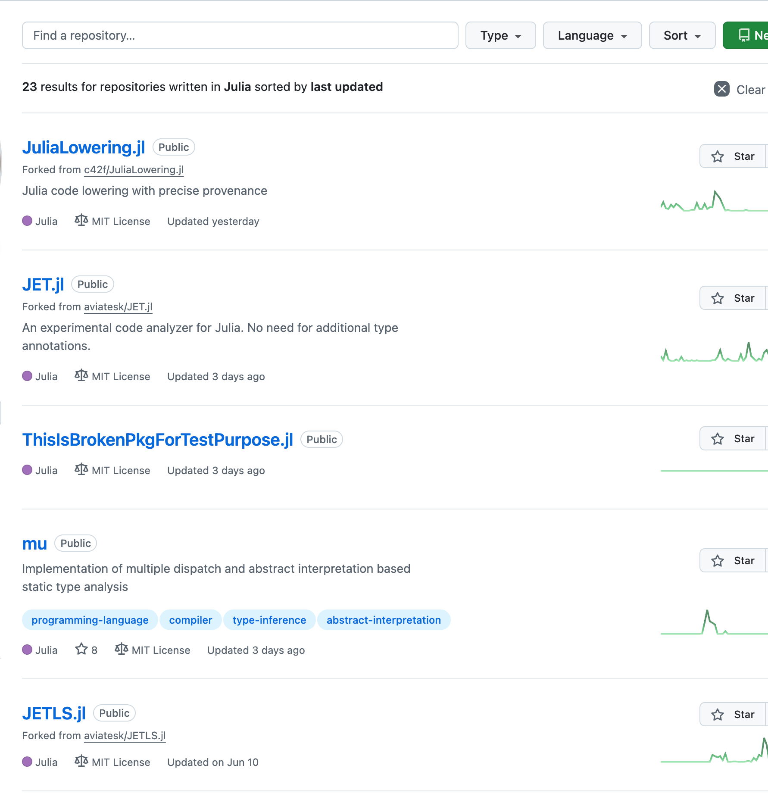
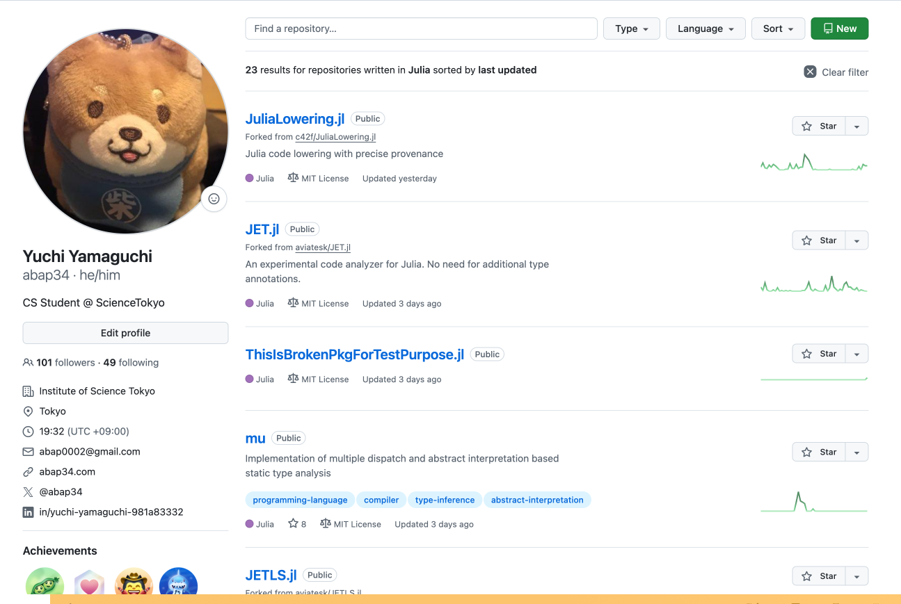

<!-- _header: Julia 使ってますか -->

<div class="section"> Introduction </div>

**Julia を...**

# 聞いたことある 🙋‍♀️🙋‍♂️

---


<!-- _header: Julia 使ってますか -->

<div class="section"> Introduction </div>

**Julia を...**

# 使ったことがある 🙋‍♀️🙋‍♂️


---

<!-- _header: Julia とは -->

<div class="columns">

<div>


<br>

1. **動的・インタラクティブに使える**
1. **パフォーマンスに優れたプログラムがかける**
2. **科学技術計算に強い**

プログラミング言語．


</div>

<div>

```julia
using Base.Threads
using Statistics

function mt_pi(n)
    count = 0
    for _ in 1:n
        x, y = rand(), rand()
        if x^2 + y^2 < 1
            count += 1
        end
    end
    return 4 * count / n
end

tasks = [@spawn mt_pi(10^7) for _ in 1:nthreads()]

π̂ = tasks .|> fetch |> mean

println("π ≈ $π̂")
# π ≈ 3.1416556
```

<span style="font-size: 0.65em;">

モンテカルロ法による円周率の近似値の計算 (マルチスレッド)

</span>

</div>

</div>


---

<!-- _header: Julia とは -->

<br>

**6年くらい使っています 🖐️**

<span style="font-size: 0.8em;">

- 単に慣れているのでかなりよく書きます
- 最近の主な仕事は次世代 Language Server の開発と、そのために必要ないろいろな開発・改修 <span style="font-size: 0.8em;">(Google Summer of Code)</span>
- 広告とかのデータ分析をしている会社で Python 製の分析基盤を Julia に書き直して高速化するバイトもしたこともあります


</span>


<!-- 
https://github.com/abap34?tab=repositories&q=&type=&language=julia
 -->




---

<!-- _header: Julia とは -->

<div style="text-align: center; font-size: 1.2em;">

🤔 環境構築の仕方は？
🤔 基本文法を知りたい！
🤔 パッケージマネージャの使い方は？


</div>

---


<!-- _header: Julia とは -->

<div class="section"> Introduction </div>

<div style="text-align: center; font-size: 1.2em;">

~~🤔 環境構築の仕方は？~~
~~🤔 基本文法を知りたい！~~
~~🤔 パッケージマネージャの使い方は？~~


</div>


---


<!-- _header: Julia 使ってますか -->

<div class="section"> Introduction </div>

<div style="text-align: center; font-size: 1.2em;">

~~🤔 環境構築の仕方は？~~
~~🤔 基本文法を知りたい！~~
~~🤔 パッケージマネージャの使い方は？~~


</div>


<div style="
  position: absolute;
  top: 50%;
  left: 50%;
  backdrop-filter: blur(3px);  
  transform: translate(-50%, -50%);
  background: rgba(255, 255, 255, 0.75);
  width: 80%;
  padding: 1em 2em;
  border-radius: 8px;
  text-align: center;
  font-size: 1.5em;
  z-index: 10;
  color:red !important;
">

<span style="font-size: 1.5em; font-weight: bold;"> そんなのどうでもいいんですよ </span>

</div>


<div class="cite">

※ おもしろおかしくするための過激な表現です

</div>


---

<!-- _header: 今日の話 -->

**❌ Julia 入門**

## ✅ Julia 言語・コンパイラ入門
<br>

<span style="font-size: 0.8em;">


※ 前提としてプログラミング言語・言語処理系の基本的な知識があることを想定しています
※ 聞いても Julia が書けるようにはなりません
※ プログラミング言語を研究している人・コンパイラを作っている人にとって面白い話をします


</span>

---

<!-- _header: Table of Contents -->


<div class="columns" style="font-size: 0.8em;">

<div>      <!-- columns 1 start-->

1. Julia のキホンと特徴

## [1] Julia 言語入門

1. Julia の型と多重ディスパッチ
2. Julia のメタプログラミング

</div>   <!-- columns 1 end-->


<div> <!-- columns 2 start-->

## [2] Julia コンパイラの実装

1. Julia の実行プロセス
2. Julia の IR
3. 型推論の実装


</div> <!-- columns 2 end-->

</div>


<span style="font-size: 0.8em;">


<hr>


キーワード: Julia, Two Language Problem, 多重ディスパッチ, 抽象解釈, メタプログラミング, JIT コンパイル, LLVM, SSA IR


</span>

---


<span class="red" style="font-weight: normal; font-size: 0.6em;">


免責: なるべく正確になるように頑張っていますが， 
Julia コンパイラ全体にわたって正確に全てを把握しているわけではないので誤りがあるかもしれません．

また，研究室内のラフなゼミでの発表資料なので，雑なアイデアが含まれるものもあります．
正確性が低い可能性があるもの，雑アイデアが含まれる場合にはページの見出しに ⚠️ マークをつけているのでそのつもりで読んでください．


</span>


---