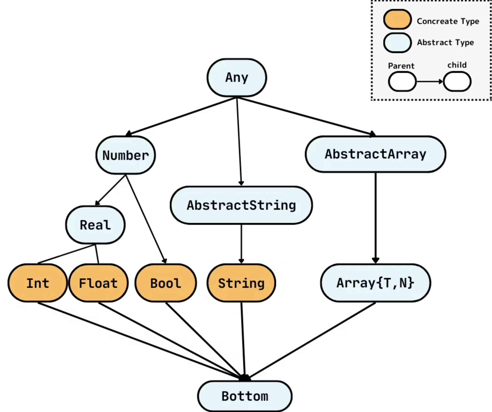

<style>
{
  font-size: 0.8rem;
}
</style>


<!-- _class: lead -->

1. Julia のキホンと特徴

---


<!-- _header: Julia のメタ情報を 20秒で -->


- 2009年から開発が始まり， 2012年にリリースされた <i class="bi bi-github"></i>
  - 当時 MIT の博士課程の学生だった Jeff Bezanson を中心に Stefan Karpinski, Viral B. Shah, Alan Edelman などによって開発がスタート
  - 今でもボストンが中心地のイメージ
  - 2018年に v1.0 リリース． 現在の最新リリースは v1.11.6
- (広く使われている) 唯一の処理系: [Julialang/julia](https://github.com/JuliaLang/julia)
  - オープンソース (MIT License)
  - Base やコンパイルプロセスの結構な部分は Julia で書かれている． C も結構． LLVM 近辺で C++ もそこそこ．フロントエンドのためにScheme 少し


---

<!-- _header: Julia のキホンと特徴 -->


Julia は、

1. 動的型付けの
2. JIT コンパイルで動作する
3. ハイパフォーマンスな

プログラミング言語です。


---


<!-- _header: Julia のキホンと特徴 -->

<div style="color: gray; font-size: 1.0em;">

Julia は、


<span style="color: black; font-weight: bold; font-size: 2.1em;">1.  動的型付けの</span>

2. JIT コンパイルで動作する

3. ハイパフォーマンスな

プログラミング言語です。

</div>


---

<!-- _header: Julia のキホンと特徴 -->

1. Julia は動的型付けのプログラミング言語です

<pre>
<code class="language-julia">
<span style="color:green">julia></span> f(x::Int) = 1       <span style="color: #0077ffff"># Int に対して `f` を実装</span>
f (generic function with 1 method)

<span style="color:green">julia></span> g(x::Float64) = (println(x); f(x))  
g (generic function with 1 method)

<span style="color:green">julia></span> g(1.0)
1.0  <span style="color: #0077ffff"># <- `g` の呼び出しが始まっている</span>
ERROR: MethodError: no method matching f(::Float64)
The function `f` exists, but no method is defined for this combination of argument types.
<span style="color: #0077ffff"># ^^^^ ランタイムエラー！</span>
</code>
</pre>

---

<!-- _header: Julia のキホンと特徴 -->


<div style="color: gray; font-size: 1.0em;">

1. 動的型付けの

<span style="color: black; font-weight: bold; font-size: 2.1em;">2. JIT コンパイルで動作する</span>

3. ハイパフォーマンスな

プログラミング言語です。

</div>

---

<!-- _header: Julia のキホンと特徴 -->


<div style="position: relative; margin: 1em;">
  <p>
    2. Julia は 
    <span style="background: lightblue; position: relative; padding: 2px; font-weight: bold; padding-left: 10px; padding-right: 10px; font-size: 1.5em;">
      JIT コンパイル
      <span style="position: absolute; left: 50%; top: 100%; width: 1px; height: 40px; background: black;"></span>
    </span>
    で動作します
  </p>
  <div style="position: absolute; top: 60px; left: 220px; width: 600px; border: 1px solid #333; padding: 5px; background: #f9f9f9; font-size: 0.75em;">
    (初見の引数の型で呼び出されたそのときにコンパイルする)
  </div>
</div>


<pre>
<code class="language-julia">
<span style="color:green">julia></span> f(x) = x + 1 <span style="color: #0077ffff"># method `f` を定義</span>
f (generic function with 1 method)

<span style="color:green">julia></span> f(1) <span style="color: #0077ffff"># Int 型の引数で <span style="font-weight: bold;">初めて</span> 呼び出し．このタイミングで <span style="font-weight: bold;"> Int 向けに </span>コンパイルされる</span>
2

<span style="color:green">julia></span> f(1.0) <span style="color: #0077ffff"># Float64 型の引数で <span style="font-weight: bold;">初めて</span> 呼び出し．このタイミングで <span style="font-weight: bold;"> Float64 向けに </span>コンパイルされる</span>
2.0
</code>
</pre>

<span style="font-size: 0.8em;">

※ V8 のような Tracing JIT はしない．
※ コンパイルは基本的にメソッド単位

</span>


---

<!-- _header: Julia のキホンと特徴 -->

<div style="color: gray; font-size: 1.0em;">
Julia は、

1. 動的型付けの

2. JIT コンパイルで動作する

<span style="color: black; font-weight: bold; font-size: 2.1em;">3. ハイパフォーマンスな</span>

プログラミング言語です。

---

<!-- _header: Julia のキホンと特徴 -->

<span class="orangelined">**このプログラミング言語は速い！というのはとても難しい**</span>
<span style="font-size: 0.8em;">(ほとんどの速度比較に対して問題点を指摘できる自信があります)</span> が...

<br>


<div class="center">

<span style="font-size: 0.8em;">ざっくり</span>


# Julia は速い

<br>

... はおそらくほぼコンセンサスが得られている

<span style="font-size: 0.8em;">
(少なくとも Python/R よりはずっと速い， C/C++/Fortran と比較対象になれるくらい)</span>

</div>

---

<!-- _header: Julia が速いと何が嬉しいのか？ -->

よくいわれる話:

# Two-Language Problem

---

<!-- _header: Two-Language Problem -->


**科学技術計算側からの需要**:

- 高速に実験をするために，プロトタイピングがしやすい言語を使いたい．
- 職業プログラマではないので，学習コストが低い言語を使いたい．
- 大規模な計算のためにパフォーマンスが良いプログラムが書きたい．

<div class="center">


⇩


</div>


**典型的な解決策:**

1. <span class="dot-text">簡単な</span> 言語でプロトタイピングをする
2. パフォーマンス的に重要な部分を C, C++ などで書き直す


---

<!-- _header: Two-Language Problem -->

<div class="box" style="font-size: 0.75em;">
<br>

**典型的な解決策**:

1. <span class="dot-text">簡単な</span> 言語でプロトタイピングをする
2. パフォーマンス的に重要な部分を C, C++ などで書き直す

</div>

をすると...

1. <span class="orangelined">**開発コストが大きくなる**</span>
   1. ただでさえ職業プログラマじゃないのに 2つの言語を覚えないといけない
   2. 同じロジックを再実装する必要がある
2. <span class="orangelined">**コミュニティ・コード資産の分断**</span>

---


<!-- _header: Two-Language Problem -->

Julia の謳い文句:

## ✅ **プロトタイピング向き** でありながら
## ✅ **ハイパフォーマンス** なプログラムが書ける

---

<!-- _header: Julia のキホンと特徴 -->


1. どのようにして Julia は高速に動作するのか？
2. プログラミング言語としてどういう特徴があるのか？
3. どのような研究がされてきたか？

<div style="text-align: right;">

**⇨ To be continued...**

</div>


---


<!-- _class: lead -->

# Julia 言語入門

<br>


1. Types in Julia
2. 多重ディスパッチ
3. Julia のメタプログラミング


---

<!-- _header: Types in Julia -->

✅ Julia の型は subtype 関係で束をなす
 ($\top$: `Any`, $\bot$: `Union{}`)
✅ Nominal Subtyping
✅ Parametric Types あるよ
✅ 基本的には Invariant (例外あり)
✅ Union型 あるよ

```julia
struct Hoge{T <: Number} <: AbstractHoge
    x::T
    y::Float64
end
```

<div class="center">

<span style="font-size: 0.7em;">

(`AbstractHoge` の subtype である `Hoge` を定義)

</div>



---

<!-- _header: Types in Julia -->

### 重要な区別:
## **Concrete Type** と **Abstract Type**


---

<!-- _header: Types in Julia -->


**Concrete Type**

- インスタンスを生成できる型
- 例えば `Int`, `Float64`, `Hoge`, `Array{Int, 1}` など
- `Union{}` 以外の supertype にならない

**Abstract Type**

- インスタンスを生成できない型
- 例えば `Number`, `Real`, `AbstractHoge` など


---

<!-- _header: Types in Julia -->

継承とかはない！

```julia
abstract type Animal end

struct Dog <: Animal
    name::String
    is_shiba::Bool
end

struct Cat <: Animal
    name::String
    is_houce_cat::Bool
end
```

→ Julia における基本的なプログラミングスタイル: **多重ディスパッチを使った OOP**

---

<!-- _header: 多重ディスパッチ -->


```julia
abstract type Animal end

struct Dog <: Animal
    name::String
end
struct Cat <: Animal
    name::String
    is_houce_cat::Bool
end

function greet(a)
    if a isa Dog
        return "Bow-wow! I'm $(a.name)."
    elseif a isa Cat
        return "Meow! I'm $(a.name). I'm" * (a.is_houce_cat ? " a house cat." : " a wild cat.")
    end
end
```


---

<!-- _header: 多重ディスパッチ -->

もうちょっといい感じに...

```julia
abstract type Animal end

struct Dog <: Animal
    name::String
end

struct Cat <: Animal
    name::String
    is_houce_cat::Bool
end

greet(a::Dog)    = "Bow-wow! I'm $(a.name)."
greet(a::Cat)    = "Meow! I'm $(a.name). I'm" * (a.is_houce_cat ? " a house cat." : " a wild cat.")

greet(Dog("Pochi"))       # "Bow-wow! I'm Pochi."
greet(Cat("Tama", true))  # "Meow! I'm Tama. I'm a house cat."
```


---

<!-- _header: 多重ディスパッチ -->


$Q_1$ C++ とかのオーバーロードとかと同じ？
$A_1$ Julia では <span class="orangelined">**実行時**</span> にメソッドを解決してもよい．

$Q_2$ Python とかのメソッドと同じ？
$A_2$ <span class="orangelined">**特定の一引数を特別視せず**</span> すべての引数の型によってメソッドを解決する

$Q_3$ 複数メソッドとマッチしたときは？
$A_3$ 最も <span class="orangelined">**特化された**</span> $^{[1]}$ メソッドが選ばれる．同じ「特化度」のメソッドがあればエラー


<div class="cite">

[1] 例えば `(Int, Int)` は `(Int, Number)` よりも「特化」されています．型変数とかなければ引数の組に普通に積順序を入れればいいのですが絡むとかなり面倒です．
詳しくは `subtype.c#jl_type_morespecific` とかを見てください．

</div>


類似言語: Common Lisp (CLOS), Dylan, Fortress　など

---

<!-- _header: Julia のメタプログラミング -->

✅ Julia は Lisp に強く影響を受けていて，強力なリフレクション機構を備えている
✅ 衛生的マクロのサポート

例) `ex` を実行するのにかかる時間を計測するマクロ
<span style="font-size: 0.8em;"> (※ もちろん`Base` にもっとちゃんとしたのがあります) </span>

```julia
macro mytime(ex)
    quote
        t0 = time()
        result = $(esc(ex))
        t1 = time()
        println("elapsed time: ", t1 - t0, " seconds")
        result
    end
end
```


---

<!-- _header: Julia のメタプログラミング -->

<br>

展開結果:

```julia
julia> @macroexpand @mytime [sin(x) for x in 1:10^8]
quote
    #= REPL[1]:3 =#
    var"#1#t0" = Main.time()
    #= REPL[1]:4 =#
    var"#2#result" = [sin(x) for x = 1:10 ^ 8]
    #= REPL[1]:5 =#
    var"#3#t1" = Main.time()
    #= REPL[1]:6 =#
    Main.println("elapsed time: ", var"#3#t1" - var"#1#t0", " seconds")
    #= REPL[1]:7 =#
    var"#2#result"
end

julia> @mytime [sin(x) for x in 1:10^8]
elapsed time: 1.454604148864746 seconds
```

- `ex` の中で定義された変数名が衝突しないように，ユニークな名前に変換されている
- `esc` の中身はそのまま展開される

---

<!-- _header: Julia のメタプログラミング -->

😲 Julia ではマクロが結構日常的に使われている．

よく使われる便利なもの:
- `@assert`... アサーション
- `@show` ... `@show x` で `x = 1` とか出してくれるやつ
- `@inbounds`... 配列アクセスの境界チェックを無効化
- `@benchmark`... ベンチマーク (BenchmarkTools.jl)

コンパイラにヒントを出す系:

- `@inline`  ... コンパイラに積極的にインライン展開を促す
- `@nospecialize` ... specialization (ある引数の型に特化したコンパイル) を抑制
- `@constprop setting` ... 定数伝播の積極性を設定
- `@assume_effects` ,,, メソッドのエフェクト $^{[1]}$についてのヒントを与える

<div class="cite">

[1] この「エフェクト」という言葉のきちんとした取り扱いは 2章で扱います．

</div>

---

